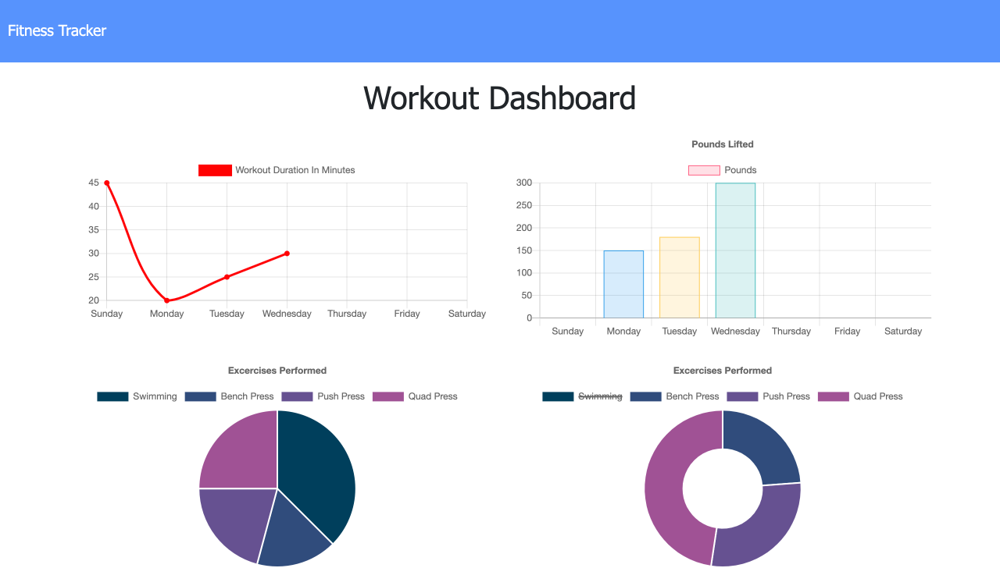

# Workout-Tracker

## Task

The purpose of this assignment is to create an application of fitness tracker for users to keep track of their workout progress. Clients would be able to view and record the daily workouts they have done and compare the data of all workouts with this application so that to reach the fitness goals in a more convenient way. MongoDB is contributed to the establishment of database of this application.

## Acceptance Criteria

When the user loads the page, they should be given the option to create a new workout or continue with their last workout.

The user should be able to:

  * Add exercises to a previous workout plan.

  * Add new exercises to a new workout plan.

  * View the combined weight of multiple exercises on the `stats` page.

## Technologies Used

* HTML
* CSS
* JavaScript
* Node.js
* Express - npm
* Mongoose - npm
* Morgan - npm

## Appearance and Functionality

Below is the page to display current day's workouts summary:

And the page to display workouts data comparison:

Here is the deployed link of the application: [Workout Tracker](https://thawing-refuge-56439.herokuapp.com/)

## URL Sources

Feel free to check the application repository: [https://github.com/ywen26/Workout-Tracker](https://github.com/ywen26/Workout-Tracker)

If you have any questions and ideas about this application, please contact me at: <yensonyu@gmail.com>

## License

MIT License

Copyright (c) [2021] [Ywuen Yu]

Permission is hereby granted, free of charge, to any person obtaining a copy of this software and associated documentation files (the "Software"), to deal in the Software without restriction, including without limitation the rights to use, copy, modify, merge, publish, distribute, sublicense, and/or sell copies of the Software, and to permit persons to whom the Software is furnished to do so, subject to the following conditions:

The above copyright notice and this permission notice shall be included in all copies or substantial portions of the Software.

THE SOFTWARE IS PROVIDED "AS IS", WITHOUT WARRANTY OF ANY KIND, EXPRESS OR IMPLIED, INCLUDING BUT NOT LIMITED TO THE WARRANTIES OF MERCHANTABILITY, FITNESS FOR A PARTICULAR PURPOSE AND NONINFRINGEMENT. IN NO EVENT SHALL THE AUTHORS OR COPYRIGHT HOLDERS BE LIABLE FOR ANY CLAIM, DAMAGES OR OTHER LIABILITY, WHETHER IN AN ACTION OF CONTRACT, TORT OR OTHERWISE, ARISING FROM, OUT OF OR IN CONNECTION WITH THE SOFTWARE OR THE USE OR OTHER DEALINGS IN THE SOFTWARE.
